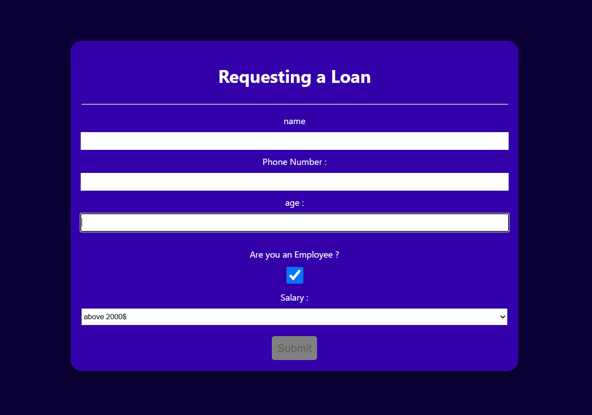

# 🏦 React Loan Form Demo

A simple **React.js** application that allows users to fill out a loan request form. It demonstrates form handling, basic validation, and the use of React Context API for managing user data.

---

## 🖼️ UI Preview



---

## 🚀 Overview

This project includes a clean and responsive form where users can input:

- Name
- Phone Number
- Age
- Employment Status
- Salary Range

The **Submit** button remains disabled until all fields are completed correctly.

---

## ⚙️ Components

- **App.js** → The main app component that provides user context and renders the form.
- **LoanForm.js** → Contains the loan request form and handles validation logic.
- **UserContext.js** → Manages global user data using React Context API.

---

## 🎨 Styling

The app is styled with simple CSS to provide:

- A deep purple background
- Rounded form container with centered layout
- Clean typography and spacing
- Disabled “Submit” button styling for better UX

---

## 💻 Run Locally

```bash
git clone https://github.com/sahiralzakaria/React-Loan-Form-Demo.git
cd React-Loan-Form-Demo
npm install
npm start
```

Then open [http://localhost:3000](http://localhost:3000) in your browser.

---

## 🧠 Future Ideas

- Add live validation and inline error messages
- Integrate with a backend API for real loan submission
- Show a confirmation message after successful submission
- Support multiple languages (English / Arabic)

---

## 👨‍💻 Author

- [](https://github.com/sahiralzakaria) **GitHub:** [sahiralzakaria](https://github.com/sahiralzakaria)
- [](https://www.linkedin.com/in/sahir-zakaria-39873531b) **LinkedIn:** [sahir-zakaria](https://www.linkedin.com/in/sahir-zakaria-39873531b)
- [](mailto:sahir.alzakaria@gmail.com) **Email:** sahir.alzakaria@gmail.com

---

<div align="center">
  <p>Made with ❤️ by <strong>Sahir Zakaria</strong></p>
  <p><em>Happy Coding! 🚀</em></p>
</div>
